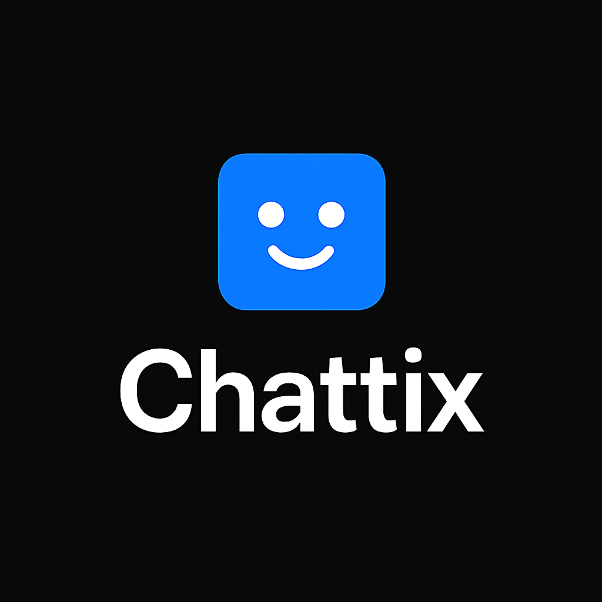
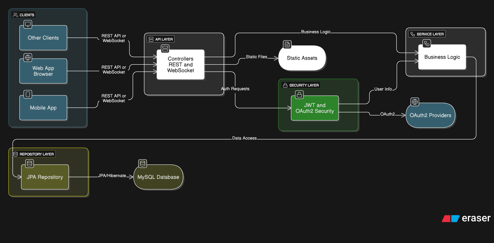

<div align="center">
  
</div>

<div align="center">


</div>

# ZChat - Real-Time Chat Application

ZChat is a modern, full-stack real-time chat application built with Java Spring Boot, WebSockets, and a responsive web frontend. It supports user registration, authentication (including Google and GitHub OAuth), private and group messaging, and a clean, user-friendly interface.

## Architecture: Backend-for-Frontend (BFF)

ZChat's server is designed using the **Backend-for-Frontend (BFF)** architectural pattern. This means the backend acts as a dedicated API gateway and orchestrator for multiple client types—not just the web frontend, but also mobile apps or other clients. The BFF layer handles authentication, business logic, and data aggregation, providing optimized, secure, and client-specific APIs. This approach ensures:

- **Separation of concerns:** Each client (web, mobile, etc.) can have tailored endpoints and logic.
- **Centralized security:** Authentication, authorization, and session management are handled in one place.
- **Scalability:** Easily extend support to new platforms (e.g., mobile apps) without major backend changes.
- **Consistent experience:** All clients benefit from unified business rules and data models.

## Architecture Diagram



## Features

- Real-time messaging with WebSocket
- User registration and login (local + OAuth2: Google, GitHub)
- Private 1:1 chat and group chat
- User presence and online status
- Group creation and management
- Secure authentication with Spring Security & JWT
- Responsive UI with dynamic user/group lists
- Persistent chat history (MySQL)
- Logout and session management

## Technology Stack

- **Backend:** Java 21, Spring Boot 3, Spring Data JPA, Spring Security, WebSocket (STOMP)
- **Frontend:** HTML5, CSS3, JavaScript (Vanilla), Thymeleaf templates
- **Database:** MySQL
- **Build Tool:** Maven
- **Other:** Docker support, Lombok, OpenAPI (Swagger)

## Getting Started

### Prerequisites
- Java 21+
- Maven 3.8+
- MySQL 8+
- (Optional) Docker

### Installation

1. **Clone the repository:**
   ```bash
   git clone <your-repo-url>
   cd chatwebsite
   ```

2. **Configure the database:**
   - Create a MySQL database (e.g., `zchat`).
   - Update `src/main/resources/application.properties` with your DB credentials:
     ```properties
     spring.datasource.url=jdbc:mysql://<host>:<port>/<db>
     spring.datasource.username=YOUR_DB_USER
     spring.datasource.password=YOUR_DB_PASSWORD
     ```

3. **(Optional) Configure OAuth2:**
   - Set your Google/GitHub OAuth client IDs and secrets in `application.properties`.

4. **Build and run the application:**
   ```bash
   mvn clean install
   mvn spring-boot:run
   ```
   The app will start on [http://localhost:8087](http://localhost:8087)

5. **Access the app:**
   - Register a new user or use OAuth2 login.
   - Start chatting!

### Docker (Optional)
To run with Docker:
```bash
docker build -t zchat .
docker run -p 8087:8087 --env-file .env zchat
```

## Configuration

Key settings in `src/main/resources/application.properties`:
- `server.port=8087` (default port)
- `spring.datasource.*` (MySQL connection)
- `spring.security.oauth2.client.registration.*` (OAuth2)
- `spring.jpa.hibernate.ddl-auto=update` (auto schema update)

## Usage

- **Register/Login:** via `/register` or `/login` (local or OAuth2)
- **Chat:** Access `/chat.html` for the main chat interface
- **Groups:** Create and join group chats
- **Logout:** Use the logout button in the UI

## Folder Structure

```
chatwebsite/
├── src/
│   ├── main/
│   │   ├── java/com/example/chatwebsite/   # Java backend (controllers, services, models)
│   │   ├── resources/
│   │   │   ├── static/                     # Static assets (js, css, images)
│   │   │   ├── templates/                  # Thymeleaf HTML templates
│   │   │   └── application.properties      # Main config
│   └── test/                              # Tests
├── pom.xml                                # Maven build file
├── Dockerfile                             # Docker support
├── README.md
├── logo.png
└── LICENSE
```

## API Documentation

- Swagger UI available at `/swagger-ui.html` (if enabled)

## License

This project is licensed under the MIT License. See [LICENSE](LICENSE) for details.

## Credits

- Developed by Mohammed Mogeab Ahmed Al-hajj
- Built with Spring Boot, Thymeleaf, and MySQL

---

For questions or contributions, please open an issue or pull request.
